# SuiteReview App for Project 3

## Explanation of Project

The SuiteReview application allows the user to create a travel review journal. The user will be able to create a profile to submit reviews for hotels and be able to view reviews left by others.


This project used the MVC file structure: Models, Views, Controllers.

The full-stack for this application is MERN Stack Node.js, Mongoose, Express and React.

One model has full CRUD and the application includes sign up/log in functionality. 

## User Story and Wireframes

### User Stories:

As a user, I should be able to create a profile, login and log-out.

As a user, I should be able to create, read, update, and delete reviews for the hotels that I have visited.

As a user, I should be able to view other reviews from different users.

As a user, I should be able to view the reviews that I have submitted.


### Wireframes:

(need to add)

## Technologies Used


<h3 align="left">Languages and Tools:</h3>
<p align="left"> <a href="https://expressjs.com" target="_blank" rel="noreferrer">  </a> <a href="https://www.mongodb.com/" target="_blank" rel="noreferrer">  </a> <a href="https://nodejs.org" target="_blank" rel="noreferrer">  </a> <a href="https://reactjs.org/" target="_blank" rel="noreferrer">  </a> </p>


## Approach

### Backend Routes

#### Hotels
***

|HTTP Verb  |URL   | Action      | Explaination          |
|-----------|------|-------------|-----------------------|
|GET        | /hotels     |Index    | returns all hotels            |
|GET        | /hotels/:id |Show     | returns a particular hotel |

#### Users
***

|HTTP Verb  |URL                    | Action      | Explaination          |
|-----------|-----------------------|-------------|-----------------------|
| GET  | /users                     |Index   | returns all users |
| GET  | /users/profile/:user_Id    |Show    | returns particular user|
| POST | /users/new                 |Create  | create new user|
| PUT  | /users/login               |Create  | log in - already a user|

#### Reviews
> [!NOTE]
> *Full CRUD for Reviews* 
***

|HTTP Verb  |URL   | Action      | Explaination          |
|-----------|------|-------------|-----------------------|
| GET   | /reviews               |Index    | returns all reviews|
| GET   | /reviews/:hotel_Id     |Index     | returns list of reviews for particular hotel   |
| GET   | /reviews/user/:user_Id | Index    | returns list of reviews for particular user|
| GET   | /reviews/review/:id    | Show    | returns one review|
| POST  | /reviews/:hotel_Id     | Create  | create new review|
| PUT   | /reviews/:id           | Update  | updates a particular review|
| DELETE| /reviews/:id           | Delete  | deletes a particular review|


### Models
***

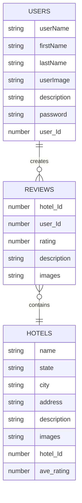

### MVC Structure of the Backend
***
``````
server.js
│
models
│   ├──hotels.js
│   ├──reviews.js
│   └──users.js
│
controllers
│   ├──hotels.js
│   ├──reviews.js
│   └──users.js
│
seedDataHotel.js
│
seedDataReviews.js
│
seedDateUsers.js


``````

### React Diagram (Document Tree)
***

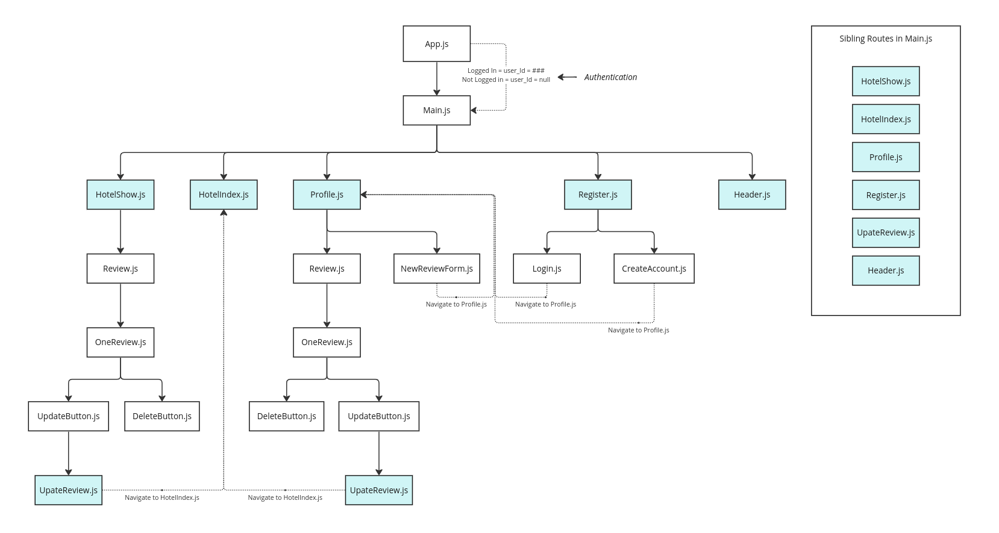

### Nested Component Structure of the Application
***
``````
App
│
└── Main
    ├── HotelIndex
    |
    ├── HotelShow
    |   └── Review
    |        └── OneReview
    |            ├── DeleteButton
    |            └── UpdateButton
    |                └── UpdateReview
    |    
    ├── Profile
    |  └── Review
    |        ├── NewReviewForm
    |        └── OneReview
    |            ├── DeleteButton
    |            └── UpdateButton
    |                └── UpdateReview
    |    
    ├── Register
    |    ├── Login
    |    └── CreateAccount 
    |
    └── Header  


``````

### Explaination of Components
***


- **App**: The root component. Sends user_Id down stream.
  - **Main**: Contains the routes (Profile, Index, Show, Update, Register, and Header pages)
    - **Page - HotelIndex**: All hotels with minimal information.
    - **Page - HotelShow**: Shows a hotel with its details and all of its reviews.
      - **Component - Review**: Section containing all the reviews.
        - **Component - NewReviewForm**: Create a review.
        - **Component - OneReview**: A review for that hotel.
          - **Component - DeleteButton**: Deletes a review.
          - **Component - UpdateButton**: Links to the UpdateReview page.
            - **Page - UpdateReview**: Form to update review.
    - **Page - Profile**: Contains the user's information and all reviews for that user.
      - **Component - Review**: Section containing all the reviews.
        - **Component - OneReview**: A review for that user.
          - **Component - DeleteButton**: Deletes a review.
          - **Component - UpdateButton**: Links to the UpdateReview page.
            - **Page - UpdateReview**: Form to update review.
    - **Page - Register**: Contains the Login and CreateAccount component.
      - **Component - Login**: Existing user logs in.
      - **Component - CreateAccount**: New user creates an account.
    - **Component - Header**: Link to Home; Logged in: Link to Profile; Logged out: Link to Login/Register


## Full CRUD (Create, Read, Update, and Delete)

#### Create
***

|HTTP Verb  |URL   | Action      | Explaination          |
|-----------|------|-------------|-----------------------|
| POST  | /reviews/:hotel_ID     | Create  | create new review|

<br>
<br>
:mag_right: Back End: This action takes the review information from the request sent from the front end and creates a new document:

```javascript
Review.create(newObj)
```
<br>
<br>

:mag_right: Location in the component diagram:

``````
App
│
└── Main    
    └── Profile
       └── Review
             └──NewReviewForm

``````

<br>
<br>

:mag_right: Illustration of communication:

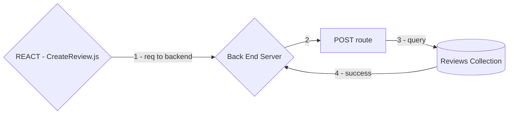


<br>
<br>

#### Read
***
Reviews on Hotel Show page:
(submission by other users)
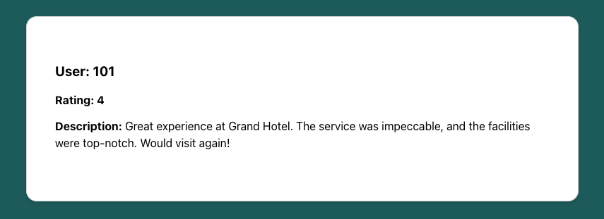
***
Reviews on Profile page:
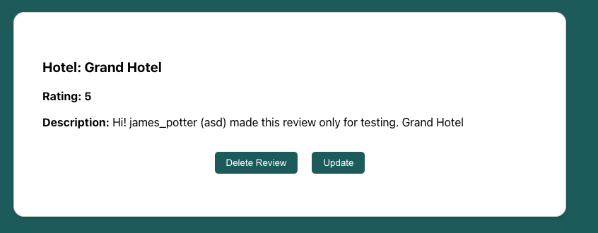
***
There are a few GET routes. This section will focus on the Review.js component under the hotel show page.

|HTTP Verb  |URL   | Action      | Explaination          |
|-----------|------|-------------|-----------------------|
| GET   | /reviews/:hotel_ID     |Index     | returns list of reviews for particular hotel   |


<br>
<br>

:mag_right: Back End: Used to find all the documents of Hotels for a particular hotel:


```javascript
Review.find({hotel_Id: Number(req.params.hotel_id)})
```


<br>
<br>


:mag_right: Location in the component diagram:
``````
App
│
└──Main
   └── HotelShow
        └── Review

``````


<br>
<br>

:mag_right: Illustration of communication:

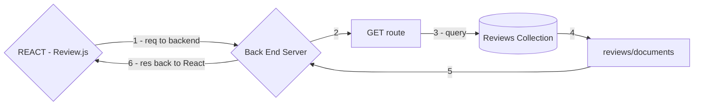


<br>
<br>


#### Update
***
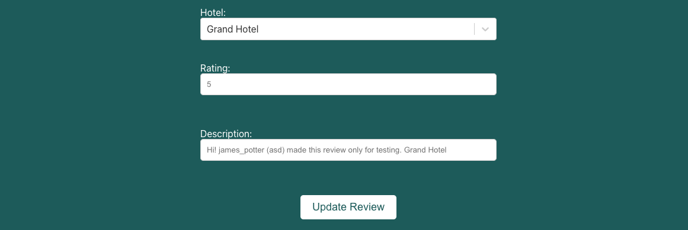
***
Although it appears twice on the tree diagram, this section will use the hotel show page branch because the functionality is the same on both branches.

|HTTP Verb  |URL   | Action      | Explaination          |
|-----------|------|-------------|-----------------------|
| PUT   | /reviews/:id           | Update  | updates a particular review|

<br>
<br>


:mag_right: Back End: Used to find particular the document of Reviews and update it:

```javascript
Review.findByIdAndUpdate(req.params.id, req.body, {new: true})
```

<br>
<br>


:mag_right: Location in the component diagram:
``````
App
│
└──Main
   └── HotelShow
       └── Review
           └── OneReview
               └── UpdateButton
                     └── UpdateReview

``````


<br>
<br>


:mag_right: Illustration of communication:

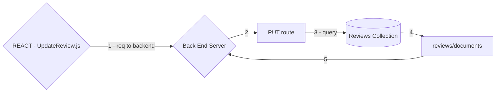


<br>
<br>


#### Delete
***
Although it appears twice on the diagram, this section will use the hotel show page branch because the functionality is the same on both branches.

|HTTP Verb  |URL   | Action      | Explaination          |
|-----------|------|-------------|-----------------------|
| DELETE| /reviews/:id           | Delete  | deletes a particular review|


<br>
<br>


:mag_right: Back End: Used to find a particular the document of Reviews and delete it:

```javascript
Review.findByIdAndDelete(req.params.id)
```


<br>
<br>


:mag_right: Location in the component diagram:
``````
App
│
└──Main
   └── HotelShow
       └── Review
           └── OneReview
               └── DeleteButton
                     

``````


<br>
<br>


:mag_right: Illustration of communication:

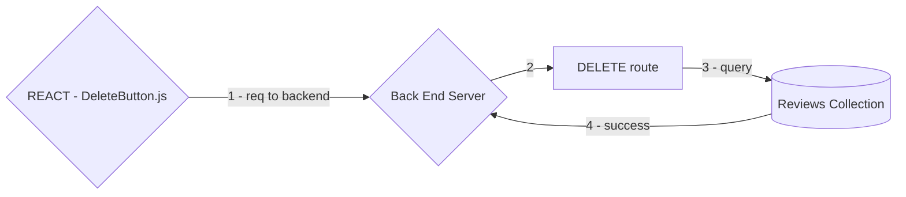


<br>
<br>

## Authentification

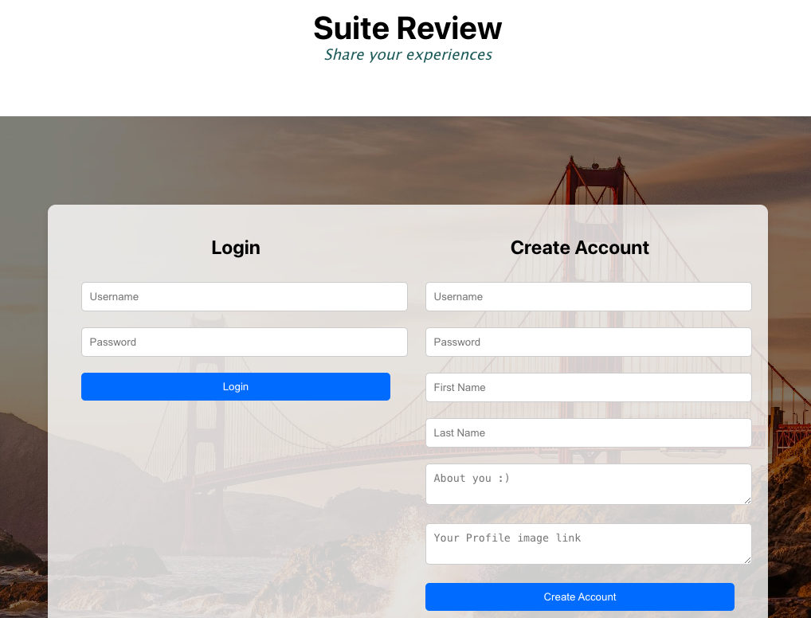
***

#### Front End
***
In React, App.js will hold the login information which will be passed down to the children.  The fields used for this are:

- <code>currentUser</code> - a json that contains all the user's information except the password
- <code>user_Id</code> - unique ID for that user

:mag_right: Illustration of Authentication from App.js to Main.js:


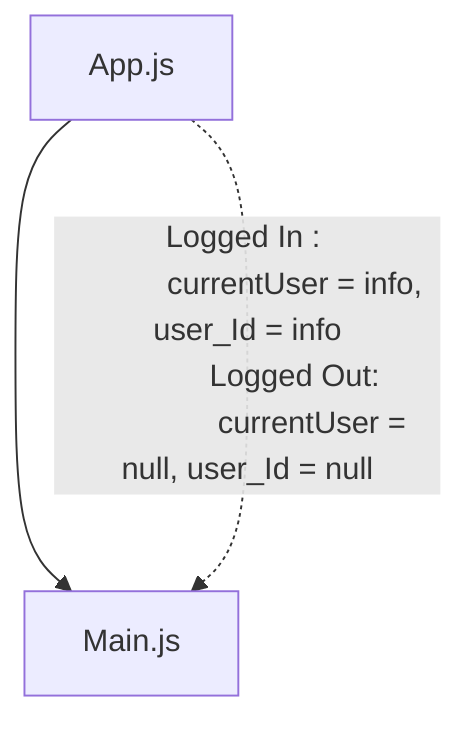
<br>
<br>

The React Hook <code>useState</code> adds state variables(<code>currentUser</code> and <code>user_Id</code>) in App.js (see below).


:mag_right: useState in App.js:
```javascript
  const [currentUser, setCurrentUser] = useState({});
  const [user_Id, setUserId] = useState('');
```
<br>
<br>

:mag_right: Illustration of App.js passing props to Main.js based on whether or not the user is logged in:


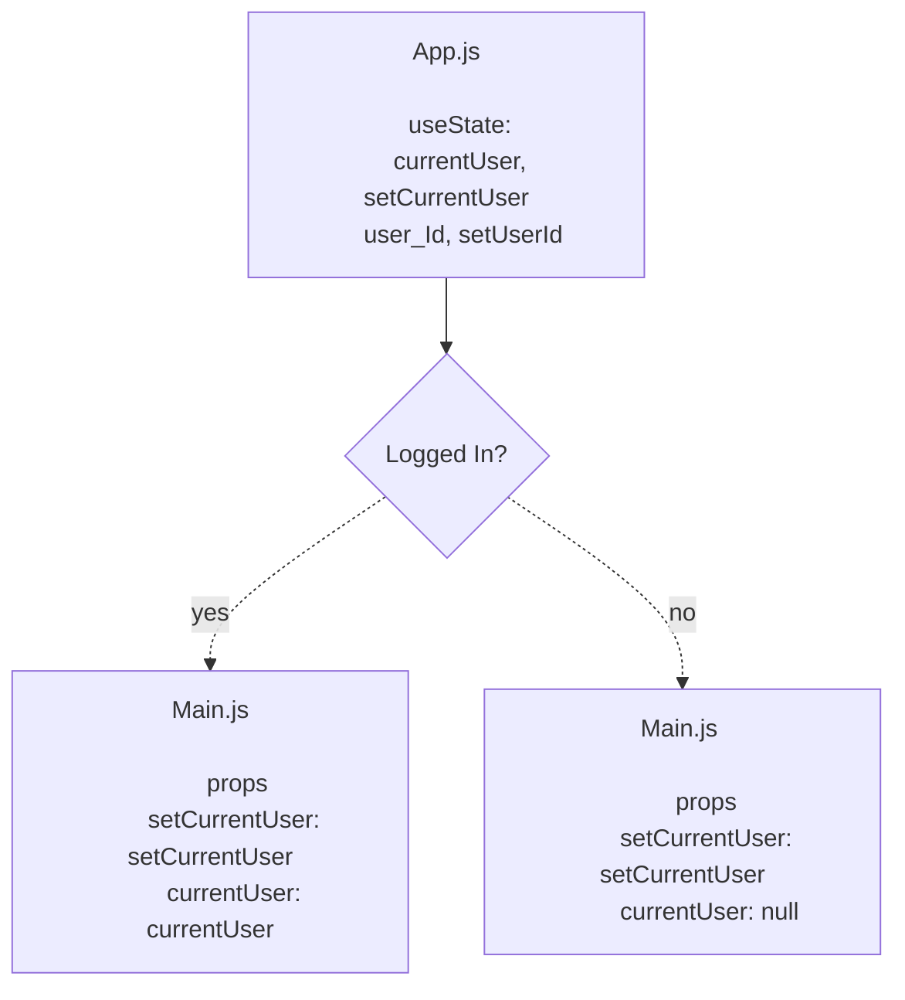
<br>
<br>

The routes are protected based on the props passed down from App.js to Main.js.

**Not Protect**
- <code>exact path="/"</code>  Component - Header
- <code>exact path="/register"</code> Component - Register
- <code>exact path="/hotels"</code> Component - HotelIndex
- <code>exact path="/hotels/:id"</code> Component - HotelShow

**Protect**
- <code>exact path="/reviews/:id"</code> Component - UpdateReview
- <code>exact path="/profile"</code> Component - Profile
- <code>exact path="/newReview"</code> Component - NewReviewForm
 <br>
 <br>
 
#### Back End
***
The Bcrypt library was used in the backend.

The passwords for the seeds were hashed and saved:

```javascript
bcrypt.hashSync(userSeeds[i]['password'] , bcrypt.genSaltSync(10))
```
<br>
<br>

#### Login
***
|HTTP Verb  |URL   | Action      | Explaination          |
|-----------|------|-------------|-----------------------|
| PUT   | /users/login      |Login     | already user   |

<br>
<br>
A user is searched for based on the userName sent from React:

```javascript
User.findOne({'userName':req.body.userName})
```
<br>
<br>

If the user exists, the password is checked to see if it's a match:
```javascript
passwordMatch =  bcrypt.compareSync(req.body.password, foundUser.password)
```
<br>
<br>

If the user exists and the password matches, the user json is sent to React with all the information except the password.
<br>
<br>
#### Create an Account
***
|HTTP Verb  |URL   | Action      | Explaination          |
|-----------|------|-------------|-----------------------|
| POST   | /users/new      |Create      | create new user   |

<br>
<br>

If the json React sent contains a password, it is hashed in preparation to be stored in the database:
```javascript
req.body.password ? bcrypt.hashSync(req.body.password, bcrypt.genSaltSync(10)) : null
```
<br>
<br>

If the following checks pass, the new account is sent back to React without the password:

**Checks to Pass**
- The following exist:
  - userName
  - firstName
  - lastNam
  - password
- The username does not already exist in the database


## Unsolved Problems

- Error Handling
- Carousel for images


  
## Forthcoming Features

- Error Handling
- Carousel

