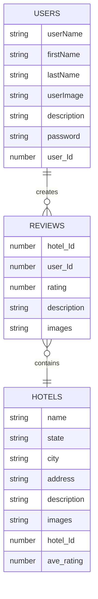
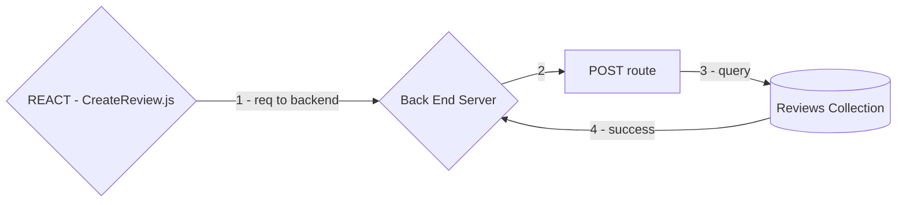
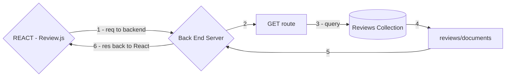
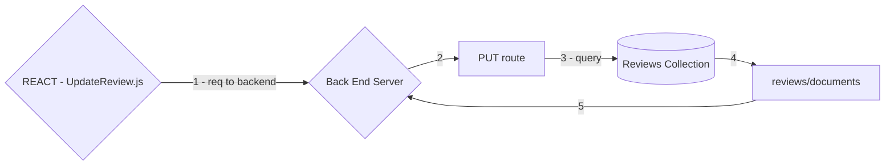
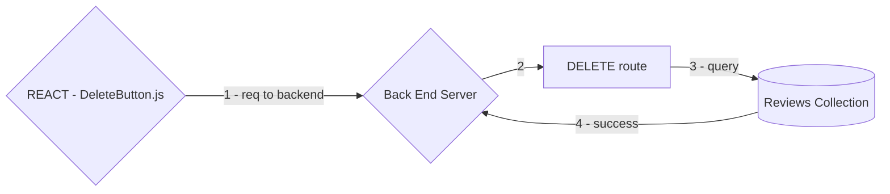

# SuiteReview App for Project 3

## Explanation of Project

The SuiteReview application allows the user to create a travel review journal. The user will be able to create a profile to submit reviews for hotels and be able to view reviews left by others.


This project used the MVC file structure: Models, Views, Controllers.

The full-stack for this application is MERN Stack Node.js, Mongoose, Express and React.

One model has full CRUD and the application includes sign up/log in functionality. 

## User Story and Wireframes

### User Stories:

As a user, I should be able to create a profile, login and log-out.

As a user, I should be able to create, read, update, and delete reviews for the hotels that I have visited.

As a user, I should be able to view other reviews from different users.

As a user, I should be able to view the reviews that I have submitted.


### Wireframes:

(need to add)

## Technologies Used


<h3 align="left">Languages and Tools:</h3>
<p align="left"> <a href="https://expressjs.com" target="_blank" rel="noreferrer">  </a> <a href="https://www.mongodb.com/" target="_blank" rel="noreferrer">  </a> <a href="https://nodejs.org" target="_blank" rel="noreferrer">  </a> <a href="https://reactjs.org/" target="_blank" rel="noreferrer">  </a> </p>


## Approach

### Backend Routes

#### Hotels
***

|HTTP Verb  |URL   | Action      | Explaination          |
|-----------|------|-------------|-----------------------|
|GET        | /hotels     |Index    | returns all hotels            |
|GET        | /hotels/:id |Show     | returns a particular hotel |

#### Users
***

|HTTP Verb  |URL                    | Action      | Explaination          |
|-----------|-----------------------|-------------|-----------------------|
| GET  | /users                     |Index   | returns all users |
| GET  | /users/profile/:user_Id    |Show    | returns particular user|
| POST | /users/new                 |Create  | create new user|
| PUT  | /users/login               |Create  | log in - already a user|

#### Reviews
#### *FULL CRUD*
***

|HTTP Verb  |URL   | Action      | Explaination          |
|-----------|------|-------------|-----------------------|
| GET   | /reviews               |Index    | returns all reviews|
| GET   | /reviews/:hotel_Id     |Index     | returns list of reviews for particular hotel   |
| GET   | /reviews/user/:user_Id | Index    | returns list of reviews for particular user|
| GET   | /reviews/review/:id    | Show    | returns one review|
| POST  | /reviews/:hotel_Id     | Create  | create new review|
| PUT   | /reviews/:id           | Update  | updates a particular review|
| DELETE| /reviews/:id           | Delete  | deletes a particular review|


### Models
***



### React Diagram (Document Tree)
***


### Nested Component Structure of the Application
***
``````
App
│
└── Main
    ├── HotelIndex
    |
    ├── HotelShow
    |   └── Review
    |        └── OneReview
    |            ├── DeleteButton
    |            └── UpdateButton
    |                └── UpdateReview
    |    
    ├── Profile
    |  └── Review
    |        ├── NewReviewForm
    |        └── OneReview
    |            ├── DeleteButton
    |            └── UpdateButton
    |                └── UpdateReview
    |    
    ├── Register
    |    ├── Login
    |    └── CreateAccount 
    |
    └── Header  


``````

### Explaination of Components
***


- **App**: The root component. Sends user_Id down stream.
  - **Main**: Contains the routes (Profile, Index, Show, Update, Register, and Header pages)
    - **Page - HotelIndex**: All hotels with minimal information.
    - **Page - HotelShow**: Shows a hotel with its details and all of its reviews.
      - **Component - Review**: Section containing all the reviews.
        - **Component - NewReviewForm**: Create a review.
        - **Component - OneReview**: A review for that hotel.
          - **Component - DeleteButton**: Deletes a review.
          - **Component - UpdateButton**: Links to the UpdateReview page.
            - **Page - UpdateReview**: Form to update review.
    - **Page - Profile**: Contains the user's information and all reviews for that user.
      - **Component - Review**: Section containing all the reviews.
        - **Component - OneReview**: A review for that user.
          - **Component - DeleteButton**: Deletes a review.
          - **Component - UpdateButton**: Links to the UpdateReview page.
            - **Page - UpdateReview**: Form to update review.
    - **Page - Register**: Contains the Login and CreateAccount component.
      - **Component - Login**: Existing user logs in.
      - **Component - CreateAccount**: New user creates an account.
    - **Page - Header**: Link to Home; Logged in: Link to Profile; Logged out: Link to Login/Register


## Full CRUD (Create, Read, Update, and Delete)

#### Create
***

**(In progress - Needs Component Diagram)**
|HTTP Verb  |URL   | Action      | Explaination          |
|-----------|------|-------------|-----------------------|
| POST  | /reviews/:hotel_ID     | Create  | create new review|

Back End: This action takes the review information from the request sent from the front end and creates a new document:
```javascript
Review.create(newObj)
```
Location in the component diagram:
``````
App
│
└── Main    
    └── Profile
       └── Review
             └──NewReviewForm

``````

Illustration of communication:




#### Read
***
There are a few GET routes. This section will focus on the Review.js component under the hotel show page.

|HTTP Verb  |URL   | Action      | Explaination          |
|-----------|------|-------------|-----------------------|
| GET   | /reviews/:hotel_ID     |Index     | returns list of reviews for particular hotel   |


Back End: Used to find all the documents of Hotels for a particular hotel:
```javascript
Review.find({hotel_Id: Number(req.params.hotel_id)})
```
Location in the component diagram:
``````
App
│
└──Main
   └── HotelShow
        └── Review

``````
Illustration of communication:



#### Update
***
Although it appears twice on the tree diagram, this section will use the hotel show page branch because the functionality is the same on both branches.

|HTTP Verb  |URL   | Action      | Explaination          |
|-----------|------|-------------|-----------------------|
| PUT   | /reviews/:id           | Update  | updates a particular review|

Back End: Used to find particular the document of Reviews and update it:

```javascript
Review.findByIdAndUpdate(req.params.id, req.body, {new: true})
```
Location in the component diagram:
``````
App
│
└──Main
   └── HotelShow
       └── Review
           └── OneReview
               └── UpdateButton
                     └── UpdateReview

``````

Illustration of communication:



#### Delete
***
Although it appears twice on the diagram, this section will use the hotel show page branch because the functionality is the same on both branches.

|HTTP Verb  |URL   | Action      | Explaination          |
|-----------|------|-------------|-----------------------|
| DELETE| /reviews/:id           | Delete  | deletes a particular review|

Back End: Used to find a particular the document of Reviews and delete it:

```javascript
Review.findByIdAndDelete(req.params.id)
```

Location in the component diagram:
``````
App
│
└──Main
   └── HotelShow
       └── Review
           └── OneReview
               └── DeleteButton
                     

``````

Illustration of communication:


## Authentification

**(In progress)**

## Unsolved Problems

- Error Handling

**(In progress)**
  
## Forthcoming Features

- Error Handling

**(In progress)**